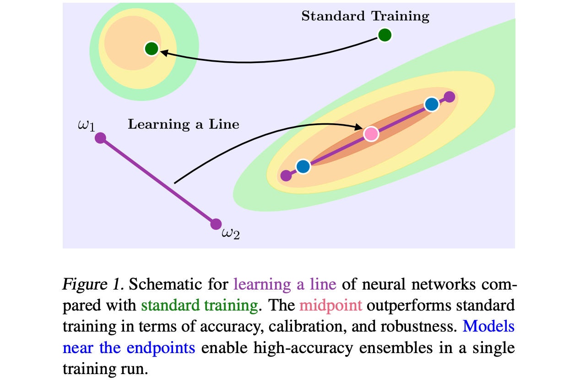

# [Learning Neural Network Subspaces](https://arxiv.org/abs/2102.10472)

Welcome to the codebase for [Learning Neural Network Subspaces](https://arxiv.org/abs/2102.10472) by Mitchell Wortsman, Maxwell Horton, Carlos Guestrin, Ali Farhadi, Mohammad Rastegari.

<p align="center">

</p>

## Abstract
*Recent observations have advanced our understanding of the neural network optimization landscape, revealing the existence of (1) paths of
high accuracy containing diverse solutions and
(2) wider minima offering improved performance.
Previous methods observing diverse paths require
multiple training runs. In contrast we aim to leverage both property (1) and (2) with a single method
and in a single training run. With a similar computational cost as training one model, we learn lines,
curves, and simplexes of high-accuracy neural networks. These neural network subspaces contain
diverse solutions that can be ensembled, approaching the ensemble performance of independently
trained networks without the training cost. Moreover, using the subspace midpoint boosts accuracy, calibration, and robustness to label noise,
outperforming Stochastic Weight Averaging.*

## Code Overview

In this repository we walk through learning neural network subspaces with [PyTorch](https://pytorch.org/).
We will ground the discussion with learning a line of neural networks.
In our code, a line is defined by endpoints `weight` and `weight1` and a point on the line is given by
`w = (1 - alpha) * weight + alpha * weight1` for some `alpha` in `[0,1]`.

Algorithm 1 (see [paper](https://arxiv.org/abs/2102.10472)) works as follows:
1. `weight` and `weight1` are initialized independently.
2. For each batch `data, targets`, `alpha` is chosen uniformly from `[0,1]` and the weights 
`w = (1 - alpha) * weight + alpha * weight1` are used in the forward pass.
3. The regularization term is computed (see [Eq. 3](https://arxiv.org/abs/2102.10472)).
4. With `loss.backward()` and `optimizer.step()` the endpoints `weight` and `weight1` are updated.

Instead of using a regular `nn.Conv2d` we instead use a `SubspaceConv` (found in `modes/modules.py`).

```python
class SubspaceConv(nn.Conv2d):
    def forward(self, x):
        w = self.get_weight()
        x = F.conv2d(
            x,
            w,
            self.bias,
            self.stride,
            self.padding,
            self.dilation,
            self.groups,
        )
        return x
```

For each subspace type (lines, curves, and simplexes) the function `get_weight` must be implemented. For lines we use:

```python
class TwoParamConv(SubspaceConv):
    def __init__(self, *args, **kwargs):
        super().__init__(*args, **kwargs)
        self.weight1 = nn.Parameter(torch.zeros_like(self.weight))

    def initialize(self, initialize_fn):
        initialize_fn(self.weight1)

class LinesConv(TwoParamConv):
    def get_weight(self):
        w = (1 - self.alpha) * self.weight + self.alpha * self.weight1
        return w
```

Note that the other endpoint `weight` is instantiated and initialized by `nn.Conv2d`. Also note that there is an
equivalent implementation for batch norm layers also found in `modes/modules.py`.

Now we turn to the training logic
which appears in `trainers/train_one_dim_subspaces.py`. In the snippet below we assume we are not training with
the layerwise variant (`args.layerwise = False`) and we are drawing only one sample from the subspace
(`args.num_samples = 1`). 


```python
for batch_idx, (data, target) in enumerate(train_loader):
    data, target = data.to(args.device), target.to(args.device)

    alpha = np.random.uniform(0, 1)
    for m in model.modules():
        if isinstance(m, nn.Conv2d) or isinstance(m, nn.BatchNorm2d):
            setattr(m, f"alpha", alpha)

    optimizer.zero_grad()
    output = model(data)
    loss = criterion(output, target)
```
All that's left is to compute the regularization term and call backward. For lines, this is given by the snippet below.

```python
    num = 0.0
    norm = 0.0
    norm1 = 0.0
    for m in model.modules():
        if isinstance(m, nn.Conv2d):
            num += (self.weight * self.weight1).sum()
            norm += self.weight.pow(2).sum()
            norm1 += self.weight1.pow(2).sum()
    loss += args.beta * (num.pow(2) / (norm * norm1))

    loss.backward()

    optimizer.step()
```

## Training Lines, Curves, and Simplexes

We now walkthrough generating the plots in Figures 4 and 5 of the [paper](https://arxiv.org/abs/2102.10472).
Before running code please install [PyTorch](https://pytorch.org/) and 
[Tensorboard](https://www.tensorflow.org/tensorboard) (for making plots
you will also need `tex` on your computer).
Note that this repository differs from that used to generate the figures in the paper, as the latter leveraged
Apple's internal tools. Accordingly there may be some bugs and we encourage you to submit an issue or send an
email if you run into any problems.

In this example walkthrough we consider TinyImageNet, which we download to `~/data` using a script such as
[this](https://gist.github.com/moskomule/2e6a9a463f50447beca4e64ab4699ac4). To run standard
training and ensemble the trained models, use the following command:
```bash
python experiment_configs/tinyimagenet/ensembles/train_ensemble_members.py
python experiment_configs/tinyimagenet/ensembles/eval_ensembles.py
```
Note that if your data is not in `~/data` please change the paths in these experiment configs.
Logs and checkpoints be saved in `learning-subspaces-results`, although this path can also be changed.

For one dimensional
subspaces, use the following command to train:
```bash
python experiment_configs/tinyimagenet/one_dimensional_subspaces/train_lines.py
python experiment_configs/tinyimagenet/one_dimensional_subspaces/train_lines_layerwise.py
python experiment_configs/tinyimagenet/one_dimensional_subspaces/train_curves.py
```
To evaluate (*i.e.* generate the data for Figure 4) use:
```bash
python experiment_configs/tinyimagenet/one_dimensional_subspaces/eval_lines.py
python experiment_configs/tinyimagenet/one_dimensional_subspaces/eval_lines_layerwise.py
python experiment_configs/tinyimagenet/one_dimensional_subspaces/eval_curves.py
```
We recommend looking at the experiment config files before running, which can be modified to change
the type of model, number of random seeds. The default in these configs is 2 random seeds.

Analogously, to train simplexes use:
```bash
python experiment_configs/tinyimagenet/simplexes/train_simplexes.py
python experiment_configs/tinyimagenet/simplexes/train_simplexes_layerwise.py
```
For generating plots like those in Figure 4 and 5 use:
```bash
python analyze_results/tinyimagenet/one_dimensional_subspaces.py
python analyze_results/tinyimagenet/simplexes.py
```
Equivalent configs exist for other datasets, and the configs can be modified to add label noise,
experiment with other models, and more. Also, if there is any functionality missing from this repository that you
would like please also submit an issue.

## Bibtex

```text
@article{wortsman2021learning,
  title={Learning Neural Network Subspaces},
  author={Wortsman, Mitchell and Horton, Maxwell and Guestrin, Carlos and Farhadi, Ali and Rastegari, Mohammad},
  journal={arXiv preprint arXiv:2102.10472},
  year={2021}
}
```